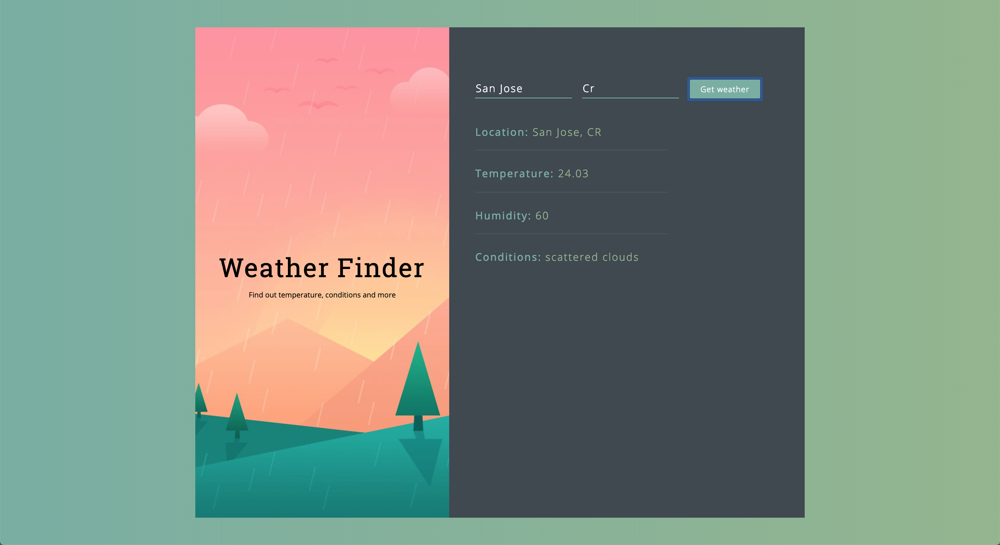

# Weather-App
This is a weather application done with React to understand its fundamental principles. This was done based on a video by Hamza Mirza on a React&API video.

## Presentational Images
The following section will present some snapshots of the game while running

##### Landing Page

##### Weather in Vancouver, Canada

##### Weather in San Jose, Costa Rica



## Getting Started
To install the application in your local machine, follow the next steps.

  1. Navigate to a directory of your choosing; this is where your application will be installed. 
  
  2. Clone the repository by running ``` git clone webUrl ``` on your bash, where *webUrl* is the Https hyperlink found in the    *Clone or Download* button.

  3. Get inside the created folder, and run ``` npm install ``` to install the node dependencies onto your local machine.
  
  4. One that is done, you can run ``` npm start ```, and the application will run on your local server.


